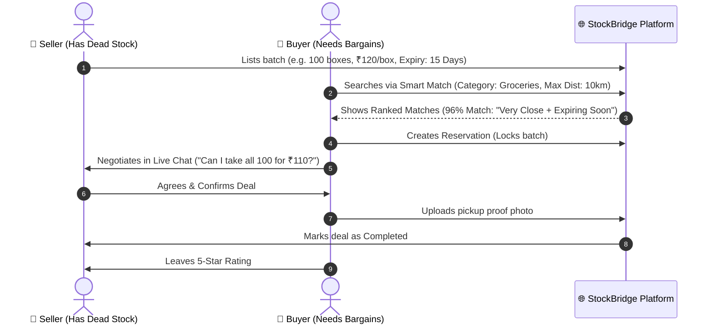

# 🚀 StockBridge — The Simplified Tech & Architecture Pitch

> **"Transforming dead stock and near-expiry inventory into immediate cash flow for businesses, through hyper-local matching and real-time deals."**

---

## 💡 1. What is StockBridge? (The 30-Second Pitch)

Every year, retailers, distributors, and food businesses lose billions of dollars throwing away unsold inventory or letting products expire on warehouse shelves. At the same time, nearby businesses are looking for discounted raw materials, bulk groceries, packaging, and goods to cut their operating costs.

**StockBridge is a B2B surplus redistribution platform.** It acts like an intelligent matchmaking and liquidation marketplace where businesses can sell surplus batches in minutes and nearby buyers can discover deep discounts before goods go to waste.

---

## 🎯 2. The Problem & Our Solution (In Simple Terms)

| The Old Way (Without StockBridge) | The StockBridge Way |
| :--- | :--- |
| ❌ Excess goods sit in storage until they expire or become obsolete. | ✅ Excess batches are listed immediately with mandatory expiry dates & clear quantities. |
| ❌ Businesses take a **100% loss** on unsold dead stock. | ✅ Sellers recover **40%–80% of capital** within hours or days. |
| ❌ Finding a buyer requires manual phone calls, brokers, or long freight. | ✅ **Smart Match Engine** instantly pairs inventory with nearby verified buyers. |
| ❌ Risky deals and endless back-and-forth haggling. | ✅ Built-in **instant chat, reservation locks, and photo proof** ensure trust. |

---

## ✨ 3. Core Features Explained Simply

### 📍 1. Hyper-Local Discovery
* **What it does:** Searches and filters surplus batches within a specific distance (e.g., within 5 km, 15 km, or 50 km).
* **Why it matters:** Eliminates long-distance freight delays. Buyers can pick up stock on the same day.

### 🧠 2. Smart Matchmaking Engine ("The Algorithm")
* **What it does:** Instead of forcing buyers to scroll through thousands of random items, buyers enter what they need, and our algorithm scores every available batch from **0% to 100%**.
* **How it calculates the score:**
  * **30% Distance:** Closer businesses score higher.
  * **25% Price Discount:** Deeper discounts score higher.
  * **15% Expiry Date:** Items expiring sooner get pushed higher so they sell before waste happens.
  * **15% Urgency:** Fast clearance lots get priority.
  * **15% Seller Trust:** Highly rated merchants get ranked higher.

### 💬 3. Real-Time Deal Negotiation (Live Chat)
* **What it does:** Buyers and sellers can chat instantly on the platform without leaving the page or sharing personal phone numbers.
* **Why it matters:** Allows rapid price and quantity agreements in real time.

### 🔒 4. Safe Reservation Workflow
* **What it does:** When a buyer makes an offer, the inventory is temporarily "reserved" so no one else can buy it.
* **Safety Lock:** If the buyer does not confirm within a set time (e.g. 30 minutes), the reservation automatically cancels and returns the stock to the open market.
* **Proof Verification:** Buyers/sellers can upload photo proof upon delivery or pickup.

### ⭐ 5. Trust & Reputation System
* **What it does:** After each transaction, both buyer and seller rate each other (1 to 5 stars) with feedback.
* **Why it matters:** Builds a trusted merchant community and weeds out dishonest sellers or non-paying buyers.

### 🛡️ 6. Admin Control Center
* **What it does:** Platform operators have an executive dashboard to monitor total sales volume, verify business accounts, moderate listings, and resolve disputes.

---

## 🏗️ 4. How the Technology Works (Under the Hood)

We designed StockBridge using a clean, modern, and lightweight architecture that is lightning fast and easy to scale.

```
┌────────────────────────────────────────────────────────┐
│             1. USER INTERFACE (Frontend)               │
│   • React + Vite + TailwindCSS                         │
│   • Instant, sleek dark-mode web app                   │
│   • Works seamlessly on laptops, tablets, and phones   │
└───────────▲───────────────────────────────▲────────────┘
            │                               │
            │ REST API Requests             │ Real-Time WebSocket Events
            │ (Data, listings, login)       │ (Instant chat, live alerts)
            ▼                               ▼
┌────────────────────────────────────────────────────────┐
│             2. THE ENGINE (Backend Server)             │
│   • Node.js & Express 5 (TypeScript)                   │
│   • JWT Authentication (Secure logins)                 │
│   • Smart Matchmaking Engine (Haversine & Ranking)     │
│   • Socket.io (Live communication server)              │
└───────────────────────────▲────────────────────────────┘
                            │
                            │ Prisma ORM (Type-safe queries)
                            ▼
┌────────────────────────────────────────────────────────┐
│             3. DATA STORAGE (Database)                 │
│   • SQLite / PostgreSQL Database                       │
│   • Stores: Users, Lots, Deals, Chats, Ratings         │
└────────────────────────────────────────────────────────┘
```

### The 4 Main Pillars of the Tech Stack:

1. **Frontend (The Face — React 19, TypeScript, Vite, TailwindCSS):**
   * Fast load times (< 1 second).
   * Reactive state management (Zustand) so data updates instantly without page reloads.
   * Premium, responsive dark-mode UI with clear price tags and urgency badges.

2. **Backend (The Brain — Node.js & Express 5):**
   * Manages user authentication securely using encrypted passwords (bcrypt) and digital tokens (JWT).
   * Enforces strict business rules (e.g., expiry date must be provided, prices and quantities cannot be negative).
   * Executes the matching algorithm in milliseconds.

3. **Database (The Vault — SQLite / Prisma ORM):**
   * Stores relational data: Which user created which listing, who reserved it, and what was negotiated in chat.
   * Easily swappable to PostgreSQL or MySQL for large-scale enterprise deployments.

4. **Real-Time Communication (The Nervous System — Socket.io):**
   * Connects buyers and sellers via persistent WebSockets.
   * Messages appear on the other person's screen in under **50 milliseconds**.

---

## 🔄 5. The Step-by-Step User Journey



---

## 📈 6. Why StockBridge is Built to Win

* **Zero Inventory Holding Risk:** StockBridge does not own warehouses or delivery trucks. It is a pure software network connecting existing inventory.
* **Network Effect:** As more local shops join in a city or district, the match quality and speed increase exponentially.
* **ESG & Sustainability Impact:** Directly reduces commercial landfill waste and food spoilage by giving surplus goods a second life.
* **High ROI for Users:** Sellers unlock trapped cash; buyers slash procurement costs by **30%–60%**.

---

## 🚀 7. Summary

StockBridge turns a chronic business headache (**dead inventory & losses**) into a profitable, real-time opportunity using **hyper-local matching, instant chat negotiations, and safe reservation workflows**.
