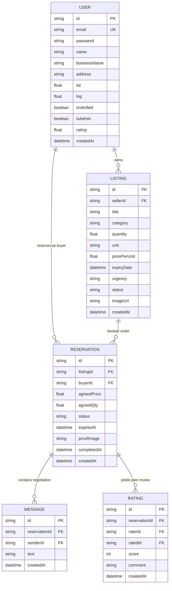
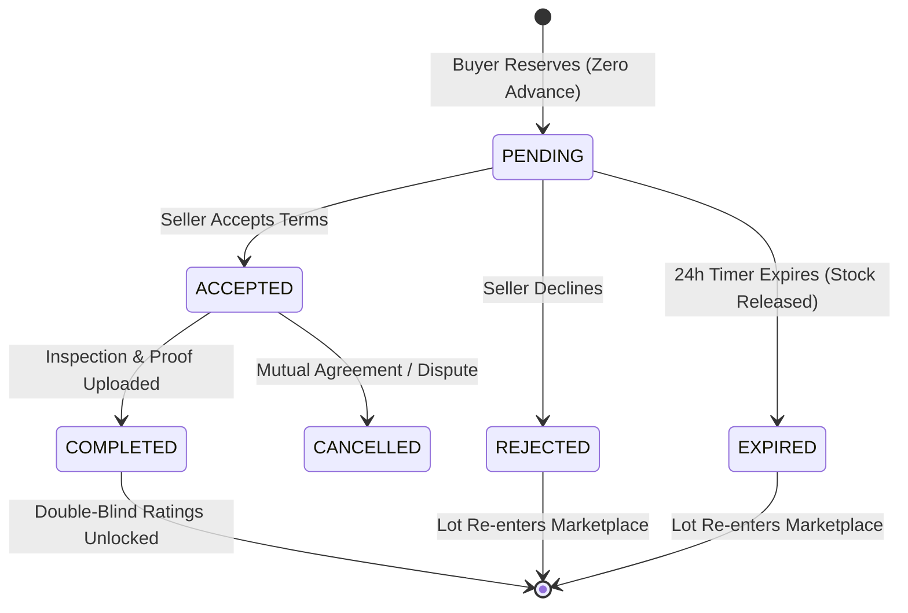

# StockBridge — Technology Architecture & System Design 🏗️

> **Comprehensive Technical Specification for the Hyperlocal B2B Liquidation Engine**

---

## 1. 📐 High-Level System Architecture

StockBridge follows a clean, decoupled client-server architecture designed for high availability, low latency, and ease of deployment.

```
┌─────────────────────────────────────────────────────────────────────────┐
│                           CLIENT LAYER                                  │
│   React 19 SPA • Vite • Tailwind v4 • Stitch UI Tokens • Framer Motion  │
│   Zustand (State) • Web Speech API (Client-side STT) • Socket.IO Client │
└────────────────────┬───────────────────────────────▲────────────────────┘
                     │ HTTPS (REST)                  │ WebSockets (WSS)
                     ▼                               │
┌────────────────────────────────────────────────────┴────────────────────┐
│                           BACKEND SERVICES                              │
│   Node.js 20+ • Express 5 • TypeScript • Socket.IO Server Engine        │
│                                                                         │
│   ┌──────────────────┐  ┌──────────────────┐  ┌─────────────────────┐  │
│   │  Auth & Users    │  │ Matching Engine  │  │ Voice Extraction AI │  │
│   │  JWT & Bcrypt    │  │ Haversine Search │  │ Gemini & Regex Fall │  │
│   └──────────────────┘  └──────────────────┘  └─────────────────────┘  │
│   ┌──────────────────┐  ┌──────────────────┐  ┌─────────────────────┐  │
│   │ Listing Pipeline │  │ 24h Reservation  │  │ Double-Blind Rating │  │
│   │ Validation (Zod) │  │ State Machine    │  │ Trust Engine        │  │
│   └──────────────────┘  └──────────────────┘  └─────────────────────┘  │
└────────────────────────────────────┬────────────────────────────────────┘
                                     │ Prisma ORM 5
                                     ▼
┌─────────────────────────────────────────────────────────────────────────┐
│                            PERSISTENCE LAYER                            │
│   Relational Database (SQLite for Dev / PostgreSQL for Production)      │
│   Tables: User • Listing • Reservation • Message • Rating               │
└─────────────────────────────────────────────────────────────────────────┘
```

---

## 2. 💻 Frontend Technical Stack

| Tier | Technology | Purpose |
| :--- | :--- | :--- |
| **Framework** | **React 19** | Latest concurrent rendering and functional component architecture. |
| **Build Tool** | **Vite 8** | Sub-second HMR (Hot Module Replacement) and optimized tree-shaken production bundles. |
| **Styling** | **Tailwind CSS v4** | Pure CSS-in-utility styling configured with custom design tokens. |
| **Design System** | **Stitch UI** | Deep charcoal theme (`#131313`, `#1c1b1b`, `#2a2a2a`, `#3d4947`, `#6bd8cb`). |
| **Typography** | **Google Fonts** | **Sora** (Headlines & Numbers) + **Work Sans** (Labels & Body Text). |
| **State Store** | **Zustand** | Lightweight, reactive state management with localStorage persistence (`authStore`). |
| **Animation** | **Framer Motion** | Micro-interactions, page route transitions, and interactive visual equalizers. |
| **Icons** | **Lucide React** | Feather-light SVG icons unified across all screens. |
| **HTTP Client** | **Axios** | Interceptor-configured REST client injecting JWT bearer tokens automatically. |

### Design System Tokens (`index.css`):
```css
:root {
  --color-background: #131313;
  --color-surface-card: #1c1b1b;
  --color-surface-container: #2a2a2a;
  --color-border-subtle: #3d4947;
  --color-primary-teal: #6bd8cb;
  --color-on-primary: #003732;
  --color-warning-amber: #f6b351;
  --color-alert-rose: #ffb4ab;
}
```

---

## 3. ⚙️ Backend Technical Stack

| Component | Technology | Rationale |
| :--- | :--- | :--- |
| **Runtime** | **Node.js (LTS 20+)** | Asynchronous, non-blocking I/O ideal for real-time order negotiation. |
| **Framework** | **Express 5** | High-throughput HTTP routing and modern middleware chain. |
| **Language** | **TypeScript 5** | Strict type safety spanning shared API requests, responses, and DB schemas. |
| **Database ORM** | **Prisma 5** | Type-safe query building, auto-generated migrations, and relational joins. |
| **Validation** | **Zod** | Runtime schema enforcement for API payloads preventing malformed data. |
| **Real-time** | **Socket.IO 4** | Bidirectional low-latency messaging rooms for buyer-seller negotiations. |
| **Security** | **JWT + Bcrypt.js** | Stateless authentication tokens and salted password hashing (10 rounds). |

---

## 4. 🗄️ Database Schema & Data Models

Managed via **Prisma ORM** (`server/prisma/schema.prisma`):



---

## 5. 📍 Proximity Matchmaking Engine

The proximity engine computes physical geodesic distance between two merchants using the **Haversine Formula**:

$$d = 2R \cdot \arcsin\left(\sqrt{\sin^2\left(\frac{\Delta \phi}{2}\right) + \cos(\phi_1)\cos(\phi_2)\sin^2\left(\frac{\Delta \lambda}{2}\right)}\right)$$

Where:
- $R = 6371\text{ km}$ (Earth's mean radius)
- $\phi_1, \phi_2$ are latitudes in radians
- $\Delta \lambda = \lambda_2 - \lambda_1$ is difference in longitude

### Multi-Factor Match Score Algorithm:
When matching a buyer's request against available stock, a composite match score ($0\% \text{ to } 100\%$) is calculated:

$$\text{Score} = (0.30 \times S_{\text{distance}}) + (0.25 \times S_{\text{discount}}) + (0.15 \times S_{\text{expiry}}) + (0.15 \times S_{\text{urgency}}) + (0.15 \times S_{\text{trust}})$$

1. **Distance Factor ($30\%$)**: Penalizes lots beyond 15 km; rewards same-neighborhood (< 3 km) stock.
2. **Discount Factor ($25\%$)**: Evaluates wholesale markdown percentage compared to standard market benchmark.
3. **Expiry Window ($15\%$)**: Prioritizes lots with 10–30 days remaining to accelerate food and perishable rescue.
4. **Urgency Weight ($15\%$)**: Distressed inventory with active clearance flags receives immediate promotion.
5. **Seller Trust ($15\%$)**: Verified merchants with $\ge 4.5$ stars receive priority placement.

---

## 6. 🎙️ Multilingual AI Voice-to-Listing Pipeline

```
[Merchant Spoken Voice]
          │
          ▼
┌────────────────────────────────────────────────────────┐
│  Web Speech API (Browser STT Engine)                   │
│  Streams live speech in hi-IN, en-IN, kn-IN, pa-IN     │
└─────────────────────────┬──────────────────────────────┘
                          │ Raw Multi-lingual Transcript
                          ▼
┌────────────────────────────────────────────────────────┐
│  Backend Parsing Pipeline (/api/voice/parse)           │
│                                                        │
│  Primary: Gemini Flash Structured LLM Extraction       │
│  Fallback: Regex Token & Unit Normalizer               │
└─────────────────────────┬──────────────────────────────┘
                          │ Structured JSON
                          ▼
┌────────────────────────────────────────────────────────┐
│  Normalized Listing Entity                             │
│  • title: "Fortune Sunflower Oil"                      │
│  • category: "Groceries"                               │
│  • quantity: 50, unit: "packets"                       │
│  • pricePerUnit: 110, expiryDate: "2026-11-20"         │
│  • urgency: "medium", confidence: 0.92                 │
└────────────────────────────────────────────────────────┘
```

### Dialect & Term Normalization
Regional Indian wholesale units are automatically normalized into canonical database quantities:
- *"Bori"* / *"Katte"* $\rightarrow$ `bags`
- *"Peti"* / *"Dabba"* $\rightarrow$ `boxes`
- *"Darjan"* $\rightarrow$ `pieces` ($\times 12$)
- *"Quintal"* $\rightarrow$ `kg` ($\times 100$)

---

## 7. ⏱️ 24-Hour Holding Window State Machine

Reservations implement a time-locked state machine preventing inventory hoarding:



1. **Locking**: When a buyer clicks "Reserve Stock", available lot quantity is decremented immediately, and `expiresAt` is set to $T + 24\text{ hours}$.
2. **Channel Opening**: A dedicated WebSocket negotiation room is instantiated for the buyer and seller.
3. **Auto-Reversion**: If the reservation remains unfulfilled past 24 hours, background scheduling transitions the status to `EXPIRED` and returns the stock quantity to the active market pool.

---

## 8. 🔒 Security & Data Integrity

- **Stateless Authentication**: Cryptographically signed JSON Web Tokens (`HMAC-SHA256`) with configurable expiration.
- **Password Security**: Passwords salted and hashed with `bcryptjs` (work factor: 10).
- **Double-Blind Reviews**: Rating records contain a `released` flag. The system only exposes scores on a seller or buyer profile when both counterparties have submitted their review, preventing retaliatory bias.
- **SQL Injection Prevention**: Prisma ORM executes parameterized queries for all database interactions.
- **Input Sanitization**: Zod schemas validate and strip unexpected payload attributes across all mutating routes (`POST`, `PUT`, `PATCH`).

---

## 9. 🚀 Deployment & DevOps Setup

- **Frontend Build**: Vite compiles to optimized static assets in `/client/dist/`. Can be hosted on Vercel, Netlify, or AWS CloudFront/S3.
- **Backend Build**: TypeScript compiled via `tsc` to `/server/dist/`. Can run in any Node.js container (AWS ECS, Render, Fly.io, or DigitalOcean Droplet).
- **Environment Variables**:
  - `DATABASE_URL`: Connection string for SQLite (`file:./dev.db`) or PostgreSQL (`postgresql://...`).
  - `JWT_SECRET`: Secret key for token signing.
  - `PORT`: Default `5000`.
  - `GEMINI_API_KEY`: Optional key for enhanced AI voice parsing.

---

**StockBridge Architecture Team** • *Built for speed, reliability, and hyperlocal scale.*
